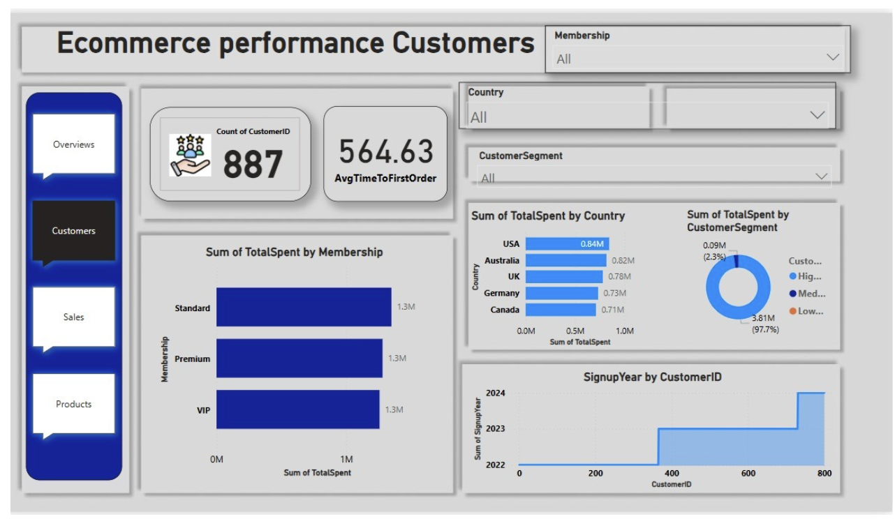
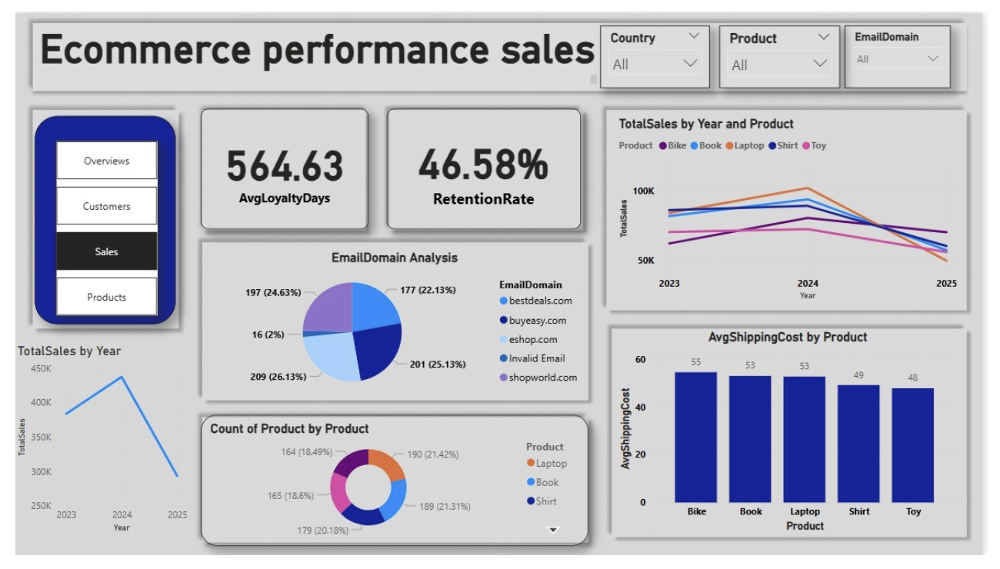
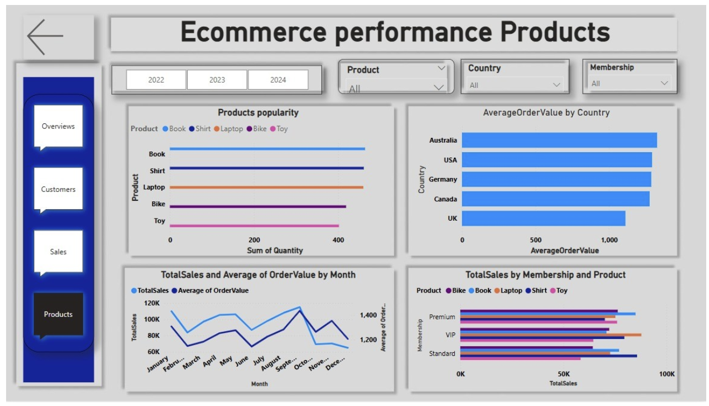

# 🛒 End-to-End Ecommerce Analysis Dashboard using Power BI

## 📘 Overview

This repository presents a **real-world e-commerce case study** built entirely in **Power BI**, transforming raw datasets into a **professional, interactive dashboard** for uncovering critical business insights. The project focuses on analyzing sales trends, customer behavior, product performance, and retention strategies for an e-commerce business.

## 📊 Dashboard Preview

## 📂 Datasets Used

- `EcommerceDataset1.xlsx`: Order details – products, quantity, price, date, shipping.
- `EcommerceDataset2.xlsx`: Customer details – demographics, memberships, total spent.

These two datasets were merged using **CustomerID** as a primary/foreign key.

---

## 🧠 Case Study Background

You're working as a Data Analyst at **Digital Commerce Insights**, tasked with helping the business uncover insights that will:
- Drive customer loyalty
- Improve retention
- Boost revenue
- Personalize offers by region or member type

Read full case study on Medium:  
🔗 [Enhancing Ecommerce Performance with Power BI](https://medium.com/@sanjanathakur302/enhancing-ecommerce-performance-with-power-bi-a-complete-case-study-4c9c38c20d8f)

---

## 🔧 Tools & Techniques

| Tool     | Purpose                                 |
|----------|------------------------------------------|
| Excel    | Initial data cleaning                    |
| Power BI | Data modeling, DAX, dashboard development |
| Figma    | Custom dashboard design template         |

---

## 🔍 Key Features & Analysis

### ✅ Data Preparation
- Merged datasets using Power Query
- Removed duplicates, filled missing values
- Converted data types and normalized columns

### 🧮 DAX Measures Created
- `TotalSales` = Quantity × UnitPrice
- `AverageOrderValue`
- `Customer Segments` (based on TotalSpent)
- `Retention Rate` & Loyalty analysis
- `Year-over-Year Sales Comparison`

---

## 📈 Insights & Recommendations

### 🟦 Overview Page
- **Total Sales**: ₹1.12M
- **Average Order Value**: ₹1.26K
- **Top Regions**: USA, Australia, Germany  
**👉 Focus marketing on top regions and launch loyalty offers.**

---

### 🟨 Sales Page
- **Loyalty Days** avg: 564
- **2024 peak**, 2025 drop in sales  
**👉 Investigate 2025 dip and clean invalid email domains.**

---

### 🟩 Customers Page
- **Most customers are low spenders**
- **Onboarding delay**: Avg 564 days  
**👉 Streamline onboarding & promote Premium tier upsells.**

---

### 🟪 Products Page
- **Top Products**: Laptops & Bikes
- **Top Value Region**: Australia  
**👉 Push best-sellers in low-performing countries.**

---

## 🧠 Learnings

- Advanced **DAX calculations** for real business use-cases
- Implemented custom layouts from **Figma**
- Used **bookmarks and slicers** for full interactivity
- Balanced storytelling with powerful KPIs

---

## 📬 Contact  
📧 **Email:** sanjanathakur302@gmail.com  
🔗 [LinkedIn](https://linkedin.com/in/sanjana-thakur-b35459246)  
🔗 [Portfolio](https://san7122.github.io/sanjanaportfolio.oi)

---

⭐ If you liked this project, don't forget to **star the repo** and share it with your network!
